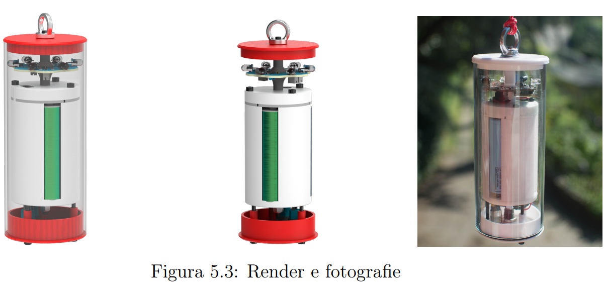
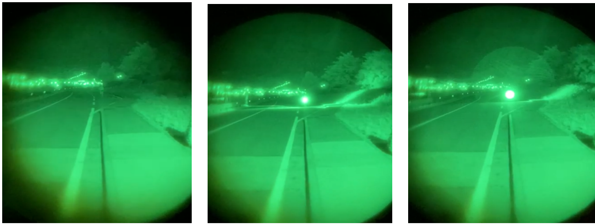
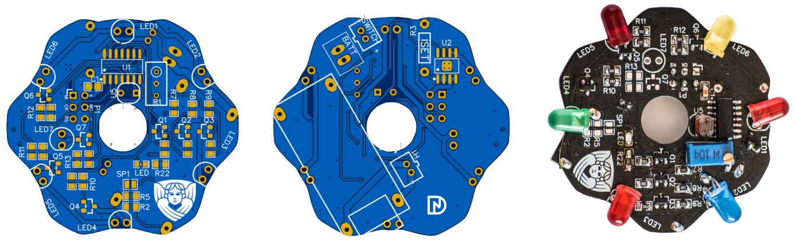

# Infrared Signal Devices for Aerial Obstacles

## Abstract

This project focuses on the design and development of **infrared signal devices** for aerial obstacle detection, aimed at improving the safety of temporary installations, such as **Highline** structures. Inspired by Swiss regulations for aerial navigation, these devices are designed to emit infrared light visible to night-vision equipment, particularly for helicopters used in rescue operations. The main goal is to offer an **open-source**, low-cost alternative to commercial infrared signal devices, which are often prohibitively expensive for nonprofit slackline communities.

## Project Overview

This repository contains the design files, schematics, and necessary documentation to build a fully operational infrared signal device, as developed in my Bachelor's thesis. The device has undergone several iterations, leading to the final version described below.

### Features

- **Compact Design**: Comparable to a smartphone in size, the device is easy to transport and install.
- **Waterproof (IP67)**: The device is designed to operate in outdoor conditions, including rain.
- **Extended Battery Life**: With a single 18650 battery (3.2 Ah), the device can last up to 40 hours of continuous operation, or approximately 4 nights.
- **Cost-Effective**: The total cost per device is around €50, compared to €500 for commercial alternatives.
- **Customizable**: The device allows for various LED patterns and types, making it adaptable to different needs.

## Hardware Specifications

- **PCB Design**: The PCB was optimized for small-scale production, using **SMD components** to reduce size and improve performance.
- **LED Driver**: Infrared LEDs are powered by a dedicated current-driven LED driver, ensuring reliable operation and efficient power usage.
- **USB-C Charging**: The device includes a USB-C port for convenient recharging.
- **Visual Battery Indicator**: Upon powering on, the device shows the battery charge level via an LED, with 1 to 5 blinks indicating the charge status.

## Assembly Instructions

1. **Print the PCB Layout**: The design files for the PCB are included in the `/pcb_design` folder.
2. **Assemble Components**: Follow the schematic in the `/schematics` folder to solder the necessary components to the PCB.
3. **Install the Electronics in the Case**: The device case is designed for ease of access, with removable top and bottom covers for maintenance.
4. **Power On**: Once assembled, insert the battery, charge it via the USB-C port, and press the power button to activate the device.

## Testing and Validation

The device was tested in collaboration with the **Trento Helicopter Rescue Unit** to validate its performance. It was visible up to a distance of 500 meters under city light pollution and further in mountain environments, making it suitable for high-altitude slacklining installations.

## Future Improvements

- **Top-mounted Infrared LED**: Future versions could include an additional infrared LED visible from above.
- **Integrated Battery Management System (BMS)**: Incorporating the BMS directly into the PCB for a more seamless design.
- **Larger-Scale Production**: The current design is optimized for small-scale production, but further improvements can make it scalable for mass production.

## Documentation

For more detailed information on the project, please refer to the following files:

- [Project Summary](SINTESI__Dispositivi_di_segnalazione_a_luce_infrarossa.pdf)
- [Image of the Final Prototype](image.png)

## License

This project is open-source under the **MIT License**. Feel free to modify and adapt the design for your specific needs.
"""

